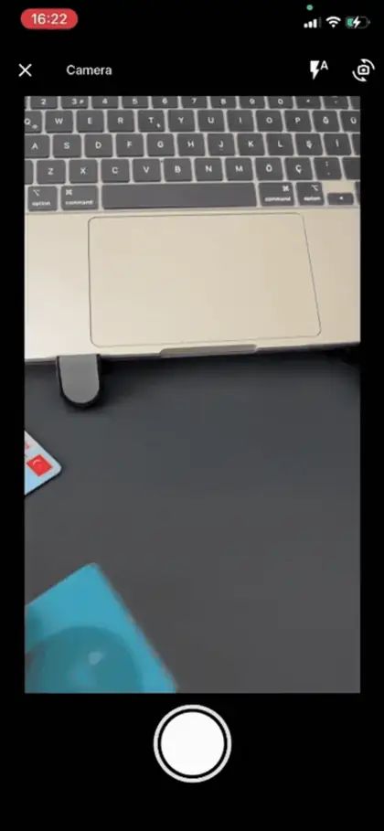
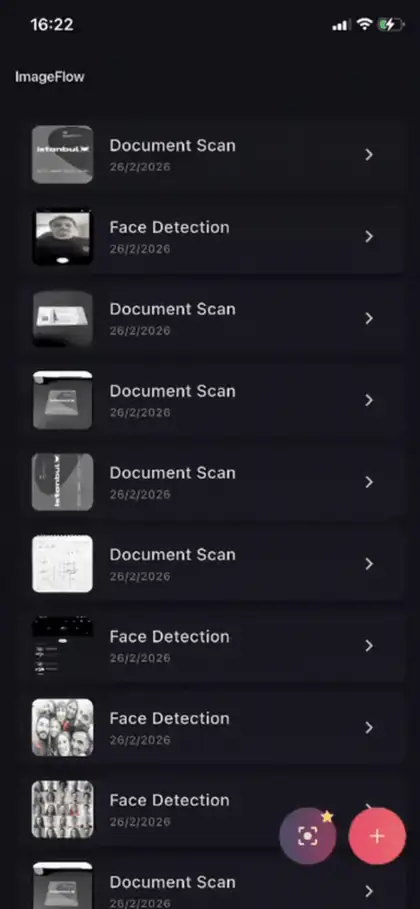
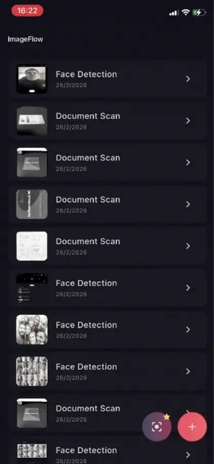
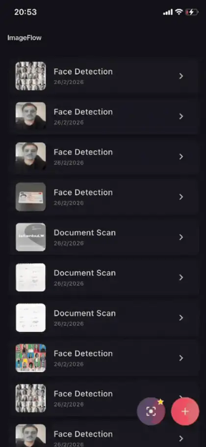
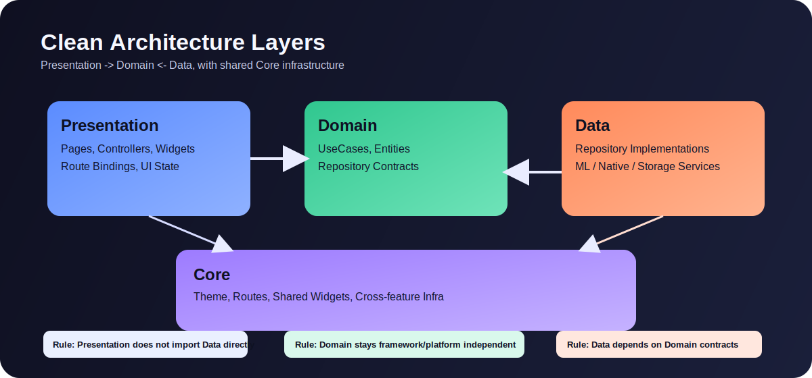
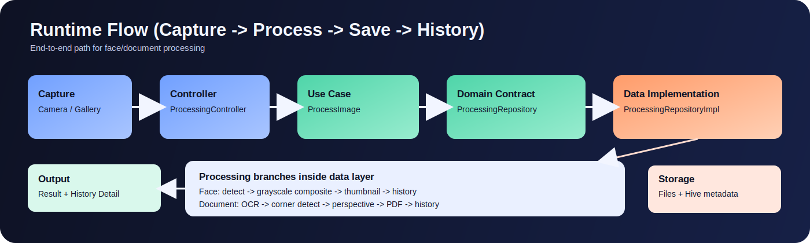
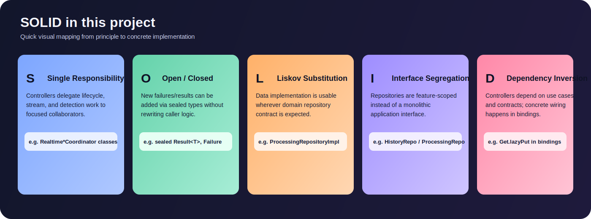

<p align="center">
  <h1 align="center">ImageFlow</h1>
  <p align="center">
    Intelligent on-device image processing app built with Flutter.<br/>
    Auto-detects faces and documents, applies the correct pipeline, and outputs processed images & PDFs — powered by native platform acceleration.
  </p>
</p>

<p align="center">
  
  
  
  
  
  
</p>

<p align="center">
  
  
  
  
  
  
</p>

---

## About This Project

Hi, I'm **Oguzhan** — a Flutter developer focused on building production-grade mobile apps with clean architecture, native platform integration, and performance-first design.

**ImageFlow** demonstrates my approach to solving a real-world computer vision problem in Flutter: building an intelligent image processing pipeline that works entirely on-device, with custom native code (Kotlin + Swift) where Flutter's plugin ecosystem falls short.

**What makes this project stand out:**
- Custom **OpenCV** (Android) and **Vision framework** (iOS) integrations via platform channels — not just plugin wrappers
- A **realtime camera overlay** system with sub-200ms face detection, OCR-gated edge detection, and isolate-backed preview generation
- Full **Clean Architecture** with sealed Result types, typed Failure hierarchies, and constructor-based DI
- Two distinct processing pipelines (face + document) with step-based progress tracking

> Flutter project root is `imageflow/`. Run all Flutter/Dart commands after `cd imageflow`.

---

## Realtime Preview

<p align="center">
  
</p>

---

## Demo Links

<p align="center">
  <a href="https://drive.google.com/drive/folders/1uKCz6YZoIHx-0wMzCsnqSiSohWGNDOYH?usp=sharing">Screenshots</a>&nbsp;&nbsp;|&nbsp;&nbsp;<a href="https://drive.google.com/drive/folders/1JbHGjMZfJxSou8LhPBovAv_D72kujkqk?usp=sharing">Videos</a>&nbsp;&nbsp;|&nbsp;&nbsp;<a href="https://drive.google.com/file/d/1ScOQW5tdcSN1ON8MmxMg0SkrvEtjFXLu/view?usp=sharing">Full Demo</a>&nbsp;&nbsp;|&nbsp;&nbsp;<a href="https://drive.google.com/file/d/1oF65RyWaD8uWlLhx4UkBZ3F7SkXcm0Nq/view?usp=sharing">APK Download</a>
</p>

---

## Table of Contents
- [Features](#features)
- [Demo Gallery](#demo-gallery)
- [Architecture](#architecture)
- [Native Platform Integration](#native-platform-integration)
- [Technical Deep Dive](#technical-deep-dive)
- [Performance Strategy](#performance-strategy)
- [Tech Stack](#tech-stack)
- [Run](#run)
- [Code Examples](#code-examples)

---

## Features

| Feature | Description |
|---|---|
| **Smart Detection** | Automatically classifies images as face or document and routes to the correct pipeline |
| **Face Pipeline** | ML Kit face detection with contour-based and bounding-box grayscale masking, before/after comparison |
| **Document Pipeline** | OCR + native corner detection, perspective correction, contrast enhancement, PDF generation |
| **Realtime Camera Overlay** | Live face bounding boxes and document edge/corner overlays with gated detection pipeline |
| **Batch Processing** | Multi-image queue with per-item status tracking and partial failure handling |
| **History & Persistence** | Local history with thumbnails, metadata, detail view, and external PDF open support |
| **Native Acceleration** | Corner detection (OpenCV/Vision) and PDF rasterization delegated to platform-native code |

---

## Demo Gallery

### Face Pipeline
<p align="center">
  
</p>
<p align="center"><em>Detect faces via ML Kit, apply region-based grayscale masking, generate before/after comparison</em></p>

### Document Pipeline
<p align="center">
  
</p>
<p align="center"><em>OCR + native corner detection, perspective correction, contrast enhancement, PDF output</em></p>

### Result + External PDF
<p align="center">
  
</p>
<p align="center"><em>Result screen with external PDF viewer action via native UIDocumentInteractionController / Intent</em></p>

### Realtime Camera Overlay
<p align="center">
  
</p>
<p align="center"><em>Live face boxes + document corners with OCR-gated edge detection — sub-200ms face detection interval</em></p>

### Home, Capture & History

<p align="center">
  &nbsp;&nbsp;
  &nbsp;&nbsp;
  
</p>
<p align="center"><em>History list with metadata & delete&nbsp;&nbsp;|&nbsp;&nbsp;Capture source dialog&nbsp;&nbsp;|&nbsp;&nbsp;History detail with content sheet</em></p>

### Batch Processing
<p align="center">
  
</p>
<p align="center"><em>Multi-image queue with per-item status, summary metrics, and partial failure handling</em></p>

---

## Architecture

Clean Architecture with three layers: **Presentation -> Domain <- Data**, powered by GetX for reactive state management and constructor-based dependency injection.

<p align="center">
  
</p>

<p align="center">
  
</p>

<p align="center">
  
</p>

### Project Structure
```text
lib/
  core/
    constants/        # App & storage constants
    enums/            # ProcessingType, NotificationType
    error/            # Result<T> sealed class, Failure hierarchy
    models/           # DetectionResult, DocumentCorners, etc.
    routes/           # GetX routing, AppPages, RouteObserver
    services/         # Core services (file, storage, PDF, permissions, modals)
    theme/            # Design tokens, color system
    utils/            # Image processing, face masks, logging, perf tracing
    widgets/          # Reusable UI components
  features/
    capture/          # Image source selection & camera capture
    processing/       # Core face/document processing pipelines
    result/           # Result screens (face comparison, document PDF)
    history/          # Local history persistence & detail view (full clean arch)
    realtime/         # Live camera overlay detection
    batch/            # Multi-image batch processing
```

### Key Design Decisions

| Decision | Rationale | Alternative Not Chosen |
|---|---|---|
| Separated realtime and final processing | Realtime must stay responsive; final output must stay high quality | One shared heavy pipeline for both |
| ML Kit `fast` mode for realtime, `accurate` for final | Better FPS in live preview without sacrificing saved output quality | Running `accurate` continuously in realtime |
| OCR gate before document edge detection | Avoids expensive native edge calls on non-document frames | Running edge detection on every eligible frame |
| Native channels for corner detection & PDF | Platform APIs (OpenCV, Vision, PDFKit) outperform pure-Dart alternatives | Full Flutter-only implementation |
| Isolate-backed heavy transforms | Keeps UI thread free during crop/rectify/filter/encode | All heavy image work on main isolate |
| Compressed/downscaled realtime previews | Controls memory and processing budget in continuous mode | Full-resolution realtime panel previews |

---

## Native Platform Integration

This app goes beyond Flutter's plugin ecosystem by implementing custom platform channels in **Kotlin** (Android) and **Swift** (iOS) for performance-critical operations.

### Native Channels Overview

| Channel | Methods | Android | iOS | Purpose |
|---|---|---|---|---|
| `corner_detection` | `detectCorners`, `detectCornersFromFrame` | OpenCV 4.13.0 contour pipeline | Vision `VNDetectRectanglesRequest` | Document corner detection (static + realtime) |
| `pdf_raster` | `rasterizePdf` | `PdfRenderer` | PDFKit `PDFDocument` | Render PDF pages to image bytes for in-app viewer |
| `pdf_external` | `openPdf` | `ACTION_VIEW` Intent + `FileProvider` | `UIDocumentInteractionController` | Open generated PDF in external app |

### Document Corner Detection (Native Deep Dive)

Corner detection is the most complex native integration, with two distinct flows optimized for different use cases:

#### A) Static Image Flow (`detectCorners`)
Used during final processing when crop accuracy is critical.

1. Flutter sends `imagePath` to native layer
2. **iOS**: Loads `CGImage` with EXIF orientation, runs `VNDetectRectanglesRequest` (Vision framework rectangle detection)
3. **Android**: Decodes bitmap with EXIF baked in, downsamples long side to ~1000px, then runs the full OpenCV edge pipeline:
   ```
   grayscale -> GaussianBlur -> threshold(TRIANGLE) -> Canny -> dilate -> findContours -> best convex quad
   ```
4. Returns corner coordinates in **pixel space** for precise cropping
5. `DocumentCropService` applies `copyRectify` + eco filter and writes the processed image

#### B) Realtime Frame Flow (`detectCornersFromFrame`)
Used during live camera preview where latency matters more than precision.

1. Flutter sends raw camera frame bytes + rotation metadata
2. **iOS**: Receives single-plane `BGRA` buffer + `bytesPerRow`, constructs `CVPixelBuffer` for Vision
3. **Android**: Receives `YUV420` planes (`y/u/v`) + row/pixel strides; native side safely reconstructs NV21 byte array for OpenCV `Mat` creation
4. Native layer runs rectangle/contour detection with **backpressure** (`frameBusy` drop policy — frames arriving while processing is in-flight are discarded)
5. Returns corners as **normalized (0..1)** values for overlay drawing

**Why two flows?**
- Static: pixel coordinates for final crop accuracy
- Realtime: normalized coordinates for fast overlay, with frame-drop backpressure to prevent queue buildup

<details>
<summary><strong>PDF Lifecycle (Generate -> View -> External Open)</strong></summary>

1. **Generate**: `ProcessingRepositoryImpl` creates PDF from processed document image (`pdf` package, A4 page layout)
2. **In-app view**: `PdfRasterService` rasterizes PDF pages via native channel with:
   - In-flight request dedupe per `pdfPath` (prevents duplicate native calls)
   - Small LRU cache (`max 3` entries) for recently rasterized pages
3. **External open**: `PdfExternalOpenService` delegates to native channel:
   - **iOS**: `UIDocumentInteractionController` with Open In menu / preview fallback
   - **Android**: `ACTION_VIEW` intent with `FileProvider` for secure file URI sharing

</details>

### Face Pipeline: Normal vs Realtime

| Aspect | Final Processing | Realtime |
|---|---|---|
| Detector mode | ML Kit `accurate`, contours enabled | ML Kit `fast`, tracking enabled |
| Output target | Saved processed file + history entry | Live overlay + preview panel |
| Mask quality | Contour-first grayscale mask on full-res image | Lightweight panel preview generation |
| Rotation handling | EXIF normalize + rotation fallback (0/90/180/270) | Per-frame rotation sync + normalized overlay mapping |
| Cost model | Quality-first (one-shot) | Latency-first (throttled periodic) |

---

## Technical Deep Dive

### Processing Pipelines (Saved Output)

| Pipeline | Input Signal | Core Stages | Saved Outputs |
|---|---|---|---|
| Face | Face detection positive | detect faces -> build face region (contour/bbox) -> grayscale mask | processed image + thumbnail + history metadata |
| Document | Text/document positive | OCR -> corner detect (native + fallback) -> perspective correction -> readability filter -> PDF generation | processed image + PDF + thumbnail + history metadata |

**Face Pipeline Detail:**
```
Copying -> DetectingFaces -> Annotating (grayscale) -> GeneratingThumbnail -> Saving
Progress:  0.0      0.2          0.5                       0.8                 0.9 -> 1.0
```

**Document Pipeline Detail:**
```
Copying -> DetectingText -> CorrectingPerspective -> EnhancingContrast -> GeneratingPDF -> GeneratingThumbnail -> Saving
Progress:  0.0     0.1          0.3                     0.5                 0.65             0.85                 0.95 -> 1.0
```

<details>
<summary><strong>Error Handling Architecture</strong></summary>

Sealed `Result<T>` type with typed `Failure` hierarchy — no exceptions leak across layer boundaries:

```dart
sealed class Result<T> {
  const Result();
  factory Result.ok(T value) = Ok<T>;
  factory Result.error(Failure failure) = Error<T>;
}
```

Failures are mapped to user-facing messages via `FailureUIMapper`, keeping presentation logic separate from error classification.

</details>

<details>
<summary><strong>Reactive State Model</strong></summary>

- All state managed through GetX `.obs` fields and `Obx()` widgets
- No `setState` usage anywhere in the codebase
- Route-level controller binding via `GetX Bindings` for scoped lifecycle management
- Constructor DI for all dependencies (no service locator anti-pattern beyond GetX `Get.find()`)

</details>

---

## Performance Strategy

### Realtime Scheduler (Actual Intervals)

| Task | Interval | Gate | Why |
|---|---:|---|---|
| Face detection | `180ms` | busy + cooldown | Keep face overlay responsive |
| OCR gate | `850ms` | busy + cooldown | Avoid expensive OCR every frame |
| Document edge detection | `260ms` | OCR must be text-positive | Edge search only when document signal is strong |
| Face panel preview build | `700ms` | cooldown + motion check | Limit image processing cost |
| Document panel preview build | `800ms` | cooldown + motion check | Limit rectify/filter/encode cost |

### Frame Execution Model (Per Cycle)

1. Scheduler checks each task against `busy` and `lastRunAt` guards
2. If due, OCR and Face detection are started **in parallel** (`Future.wait`) on the same prepared input
3. Edge detection runs **only if** OCR gate reports text and edge task is schedulable
4. Completion callbacks release `busy` flags and update overlay state

<details>
<summary><strong>OCR Gate Behavior</strong></summary>

- **Text detected**: document state transitions to edge-search mode, edge detection task is allowed to run
- **No text**: document corners and preview are reset, edge task is skipped entirely
- **Impact**: reduces false-positive edge overlays and avoids unnecessary native edge detection calls

</details>

<details>
<summary><strong>Isolate and Heavy Work Policy</strong></summary>

- Realtime face/document panel previews are isolate-backed (`Isolate.run`)
- Preview responses use **latest-request guards** — stale isolate results from earlier requests are dropped
- Main thread handles only camera preview + overlay painting
- Heavy crop/rectify/filter/encode is moved off-UI where possible
- Final processing (non-realtime) also uses isolate-heavy stages for stability on large images

</details>

### Dedupe and Motion Thresholds

| Metric | Threshold | Purpose |
|---|---|---|
| Face rect delta | `0.015` | Skip overlay update if face position barely changed |
| Face contour delta | `0.02` | Skip contour redraw for minor contour shifts |
| Document corner delta | `0.015` | Skip edge overlay for minor corner movement |
| Preview bytes | Sampled signature check | Unchanged previews don't trigger reactive updates |

Result: fewer unnecessary `Obx` rebuilds, fewer `Image.memory` re-decodes, lower GC pressure.

### Platform-Specific Realtime Profiles

| Setting | iOS | Android | Reason |
|---|---|---|---|
| Resolution | `ResolutionPreset.low` | `ResolutionPreset.medium` | iOS Vision works well at low res; Android OpenCV benefits from more pixels |
| Pixel format | `bgra8888` | `yuv420` | Native format for each platform's vision APIs |
| Stream start | Delayed `500ms` | Immediate | iOS needs startup stability time; Android activates instantly |

---

## Tech Stack

| Category | Technology |
|---|---|
| Framework | Flutter 3.41+ / Dart 3.11+ |
| State Management | GetX 4.7.x (reactive + bindings + routing) |
| Face Detection | Google ML Kit Face Detection 0.13.2 |
| Text Recognition | Google ML Kit Text Recognition 0.15.1 |
| Camera | camera 0.11.4 + image_picker 1.2.1 |
| Image Processing | image 4.5.4 + custom pipeline utilities |
| Local Storage | Hive CE 2.19.3 (NoSQL) + code generation |
| PDF Generation | pdf 3.11.3 |
| Permissions | permission_handler 12.0.1 |
| Android Native | Kotlin + OpenCV 4.13.0 (corner detection, frame processing) |
| iOS Native | Swift + Vision framework (rectangle detection) + PDFKit (rasterization) |
| Testing | flutter_test + mocktail 1.0.4 |
| Code Quality | flutter_lints 6.0.0 (strict rules) |

---

## Run

### Requirements
- Flutter `3.41.2+` (stable), Dart `3.11.0+`
- Xcode (for iOS) / Android SDK (for Android)

> **iOS Simulator Note:** ML Kit plugins may fail on simulators (especially M1-based Macs).
> Use a physical device if you encounter `Pods_Runner` linker errors.
> See: [ML Kit Known Issues](https://developers.google.com/ml-kit/known-issues)

If you use FVM, replace `flutter` with `fvm flutter` and `dart` with `fvm dart`.

### Setup
```bash
cd imageflow
flutter pub get
dart run build_runner build --delete-conflicting-outputs
```

iOS only:
```bash
cd ios && pod install && cd ..
```

### Run
```bash
flutter run
```

```bash
flutter run -d android
flutter run -d ios
flutter run -d <device_id>
```

### Quality Checks
```bash
flutter analyze
flutter test
```

---

## Code Examples

<details>
<summary><strong>Sealed Result Pattern (OCP)</strong></summary>

```dart
sealed class Result<T> {
  const Result();
  factory Result.ok(T value) = Ok<T>;
  factory Result.error(Failure failure) = Error<T>;
}
```

</details>

<details>
<summary><strong>Reactive State with GetX</strong></summary>

```dart
final historyList = <ProcessingHistory>[].obs;
final failure = Rxn<Failure>();

final result = await _getAllHistory();
switch (result) {
  case Ok(:final value):
    historyList.assignAll(value);
  case Error(:final failure):
    this.failure.value = failure;
}
```

</details>

<details>
<summary><strong>Constructor DI via Bindings (DIP)</strong></summary>

```dart
Get.lazyPut<ProcessingController>(
  () => ProcessingController(
    processImage: Get.find(),
    saveHistory: Get.find(),
    historyMapper: Get.find(),
  ),
);
```

</details>

<details>
<summary><strong>Repository Contract + Impl (ISP + LSP)</strong></summary>

```dart
// Domain layer — abstract contract
abstract class HistoryRepository {
  Future<Result<List<ProcessingHistory>>> getAll();
  Future<Result<ProcessingHistory>> getById(String id);
  Future<Result<void>> save(ProcessingHistory history);
  Future<Result<void>> delete(String id);
}

// Data layer — concrete implementation
class HistoryRepositoryImpl implements HistoryRepository {
  const HistoryRepositoryImpl(this._box, this._fileService);
  // ...
}
```

</details>

<details>
<summary><strong>Realtime SRP Assembly</strong></summary>

```dart
// Each coordinator has a single responsibility
_detectionOrchestrator = RealtimeDetectionPipelineCoordinator(...);
_frameProcessor = RealtimeFrameProcessor(...);
_framePipelineTrigger = RealtimeStreamCoordinator(...);
_sessionLifecycleHelper = RealtimeCameraSessionCoordinator(...);
_routeLifecycleHelper = RealtimeRouteLifecycleCoordinator(...);
```

</details>

<details>
<summary><strong>Performance Config as Source of Truth</strong></summary>

```dart
static const android = CaptureRealtimeConfig(
  faceInterval: Duration(milliseconds: 180),
  ocrInterval: Duration(milliseconds: 850),
  edgeInterval: Duration(milliseconds: 260),
  facePanelInterval: Duration(milliseconds: 700),
  documentPanelInterval: Duration(milliseconds: 800),
  minFaceRectDelta: 0.015,
  minDocumentCornerDelta: 0.015,
);
```

</details>

<details>
<summary><strong>Centralized Modal Handling</strong></summary>

```dart
class ModalService extends GetxService {
  Future<bool> confirm({
    required String title,
    required String message,
    String confirmLabel = 'Delete',
  }) async { /* ... */ }
}
```

</details>
